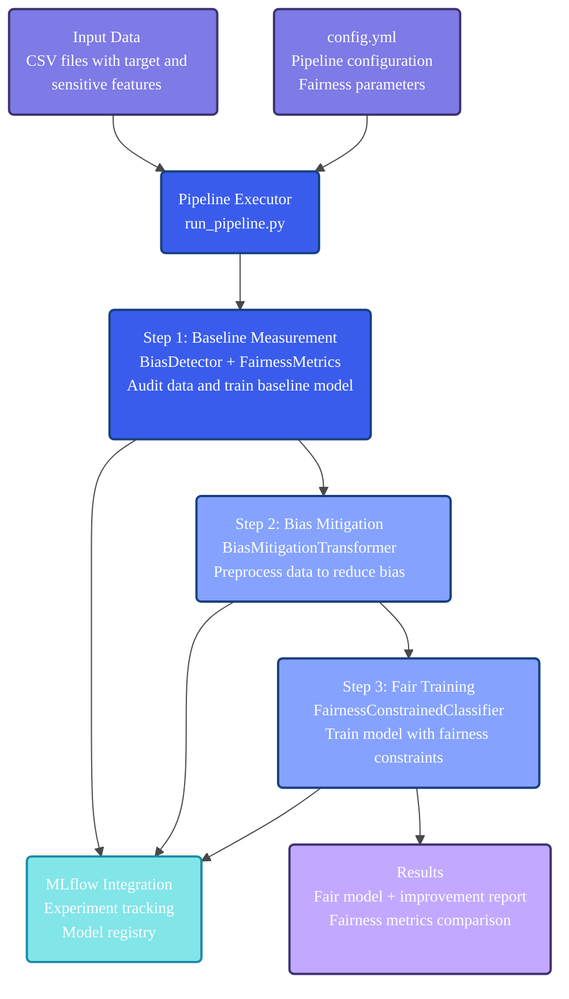
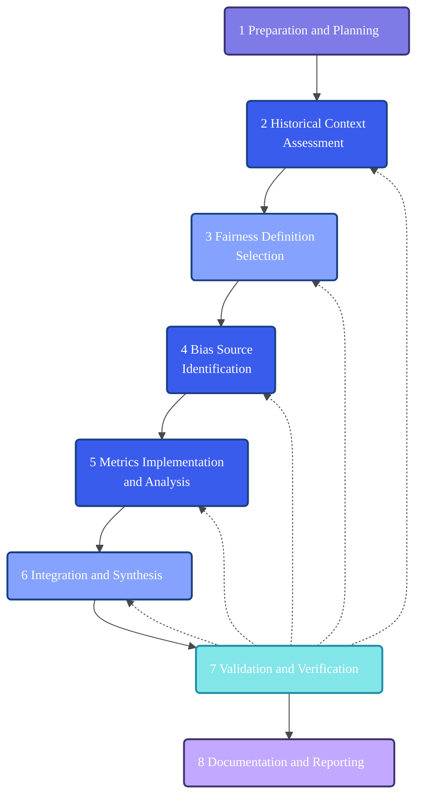

# Fairness Pipeline Toolkit

A Python toolkit for building fairness-aware machine learning pipelines with bias detection, data debiasing, and fairness-constrained model training.

## Installation

### Recommended: Using uv

```bash
git clone https://github.com/TuringCollegeSubmissions/vytbunev-AIET.DS.1.5.git
cd fairness-pipeline-toolkit
uv sync
```

### Alternative: Using pip

```bash
git clone https://github.com/TuringCollegeSubmissions/vytbunev-AIET.DS.1.5.git
cd fairness-pipeline-toolkit
pip install -e .
```

## Quick Start

### Option 1: Direct Python Execution
```bash
python run_pipeline.py config.yml
```

### Option 2: Using uv (Recommended)
```bash
uv run python run_pipeline.py config.yml
```

### Option 3: Interactive Jupyter Notebook
```bash
uv run jupyter lab notebooks/demo.ipynb
# or
jupyter lab notebooks/demo.ipynb
```

### View Results
```bash
mlflow ui  # View experiment tracking
```

### Run Tests
```bash
python -m pytest tests/
# or
uv run python -m pytest tests/
```

## Architecture



## What It Does

The toolkit executes a three-step fairness pipeline:

1. **Baseline Measurement**: Analyzes raw data for bias and fairness violations
2. **Data Processing & Training**: Applies bias mitigation and trains fair models
3. **Final Validation**: Compares results and generates improvement reports

## Configuration

Edit `config.yml` to define your pipeline:

```yaml
data:
  input_path: "your_data.csv"
  target_column: "target"
  sensitive_features: ["race", "sex"]
  test_size: 0.2
  random_state: 42

preprocessing:
  transformer:
    name: "BiasMitigationTransformer"
    parameters:
      repair_level: 0.8

training:
  method:
    name: "FairnessConstrainedClassifier"
    parameters:
      base_estimator: "LogisticRegression"
      constraint: "demographic_parity"

evaluation:
  primary_metric: "demographic_parity_difference"
  fairness_threshold: 0.1

mlflow:
  experiment_name: "fairness_pipeline"
  log_model: true
```

## Core Components

### Configuration Module
- **ConfigParser**: Validates and manages pipeline configuration from YAML files
- **Logging System**: Structured JSON logging with performance monitoring and fairness metrics tracking

### Measurement Module
- **BiasDetector**: Identifies bias in datasets and model predictions
- **FairnessMetrics**: Calculates demographic parity, equalized odds, and other fairness metrics

### Pipeline Module
- **BiasMitigationTransformer**: Reduces bias by adjusting feature distributions

### Training Module
- **FairnessConstrainedClassifier**: Enforces fairness constraints during model training
- **FairClassifier**: Base class for implementing fair classification algorithms

## MLflow Integration

Automatically tracks and logs:
- **Performance metrics**: accuracy, precision, recall, F1-score
- **Fairness metrics**: demographic parity difference, equalized odds difference
- **Model artifacts**: trained models with metadata
- **Configuration files**: complete pipeline settings for reproducibility

## Requirements

- Python 3.13+ (or check .python-version)
- Core dependencies: scikit-learn, pandas, numpy, fairlearn, mlflow
- Optional: jupyter (for demo notebook)

## Development

```bash
# Install with development dependencies
uv sync --extra dev

# Run code quality checks
uv run ruff check
uv run mypy src/

# Install with notebook support
uv sync --extra notebook
```

## Example Output

```
Loading configuration from: config.yml
✓ Configuration validated

BASELINE PREDICTION REPORT

     Performance Metrics      
                              
 Metric          Value
 ──────────────────────────── 
 Accuracy        0.9075
 Precision       0.8956
 Recall          0.9075


                           Fairness Metrics                            
                                                                       
 Metric                        Value     Status       Threshold
 ───────────────────────────────────────────────────────────────────── 
 Demographic Parity Difference  0.0487   ✅ OK           ≤ 0.1
 Equalized Odds Difference      0.4848   ❌ VIOLATION    ≤ 0.1

⚠️  1 fairness violations detected

FINAL PREDICTION REPORT

     Performance Metrics      
                              
 Metric          Value
 ──────────────────────────── 
 Accuracy        0.8950
 Precision       0.8824
 Recall          0.8950


                           Fairness Metrics                            
                                                                       
 Metric                        Value     Status       Threshold
 ───────────────────────────────────────────────────────────────────── 
 Demographic Parity Difference  0.1429   ❌ VIOLATION    ≤ 0.1
 Equalized Odds Difference      0.6667   ❌ VIOLATION    ≤ 0.1

⚠️  2 fairness violations detected

IMPROVEMENT COMPARISON

                   Performance Metrics Comparison                    
                                                                     
 Metric     Baseline    Final          Change           Status
 ─────────────────────────────────────────────────────────────────── 
 Accuracy    0.9075    0.8950     -0.0125 (-1.4%)    📉 Decreased

                      Fairness Metrics Comparison                      
                                                                       
 Metric                        Baseline   Final   Improvement   Status
 ─────────────────────────────────────────────────────────────────────
 🎯 Demographic Parity Difference  0.0487   0.1429   -0.0942     ❌ Worse
    (Primary)

Summary: Primary fairness goal not achieved (-0.0942 change)

Successfully registered model 'fairness_pipeline_model'.
```

# Creating Flowcharts with Mermaid

To create flowcharts with a consistent color scheme like the example, follow this template:

```
%%{init: {'theme': 'base', 'themeVariables': { 'fontFamily': 'Gordita, Figtree, sans-serif', 'primaryColor': '#B8CCF4', 'primaryTextColor': '#1A1E21', 'lineColor': '#48494C', 'fontSize': '14px'}}}%%
flowchart TD
    S1("1 First Step Title"):::prepStyle
    S2("2 Second Step<br>Title"):::analysisStyle
    S3("3 Third Step<br>Title"):::decisionStyle
    
    S1 --> S2
    S2 --> S3
    
    classDef prepStyle fill:#7E7AE6,stroke:#3D3270,stroke-width:2px,color:#FFFFFF,rx:4,ry:4
    classDef analysisStyle fill:#3A5CED,stroke:#18407F,stroke-width:2px,color:#FFFFFF,rx:4,ry:4
    classDef decisionStyle fill:#85A2FF,stroke:#18407F,stroke-width:2px,color:#FFFFFF,rx:4,ry:4
    classDef validationStyle fill:#82E5E8,stroke:#1C8BA5,stroke-width:2px,color:#FFFFFF,rx:4,ry:4
    classDef documentationStyle fill:#C2A9FF,stroke:#3D3270,stroke-width:2px,color:#FFFFFF,rx:4,ry:4
```

## Style Guide

This color palette uses a blue-purple theme with distinct colors for different process stages:
- **prepStyle**: Purple-blue (`#7E7AE6`) - For preparation/planning steps
- **analysisStyle**: Primary blue (`#3A5CED`) - For analytical/assessment steps
- **decisionStyle**: Light blue (`#85A2FF`) - For decision/selection steps
- **validationStyle**: Aqua (`#82E5E8`) - For validation/verification steps
- **documentationStyle**: Lavender (`#C2A9FF`) - For documentation/reporting steps

## Key Tips for Avoiding Rendering Issues

1. Use `flowchart TD` instead of `graph TD`
2. Use parentheses `()` for nodes instead of square brackets `[]`
3. Avoid periods after numbers (use "1 Text" not "1. Text")
4. Use "and" instead of ampersands (&)
5. For multi-line text, use `<br>` tags
6. For feedback loops, use dotted lines: `S7 -.-> S3`
7. Define separate arrows for each feedback connection (don't use `&` to join them)

## Complete Example



This template produces a diagram that distinguishes between process stages and uses a consistent blue-purple color palette.

## License

This project is released under The Unlicense (public domain). See the LICENSE file for details.