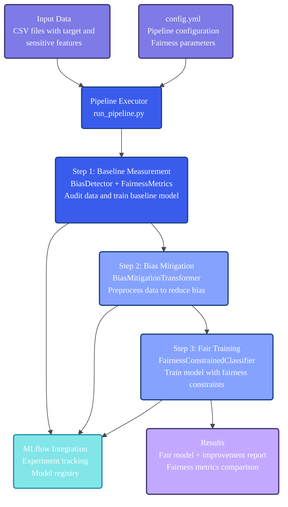

# Fairness Pipeline Toolkit

A Python toolkit for building fairness-aware machine learning pipelines with bias detection, data debiasing, and fairness-constrained model training.

## Installation

### Recommended: Using uv

```bash
git clone https://github.com/TuringCollegeSubmissions/vytbunev-AIET.DS.1.5.git
cd fairness-pipeline-toolkit
uv sync
```

### Alternative: Using pip

```bash
git clone https://github.com/TuringCollegeSubmissions/vytbunev-AIET.DS.1.5.git
cd fairness-pipeline-toolkit
pip install -e .
```

## Quick Start

### Option 1: Direct Python Execution
```bash
python run_pipeline.py config.yml
```

### Option 2: Using uv (Recommended)
```bash
uv run python run_pipeline.py config.yml
```

### Option 3: Interactive Jupyter Notebook
```bash
uv run jupyter lab notebooks/demo.ipynb
# or
jupyter lab notebooks/demo.ipynb
```

### View Results
```bash
mlflow ui  # View experiment tracking
```

### Run Tests
```bash
python -m pytest tests/
# or
uv run python -m pytest tests/
```

## Architecture



## What It Does

The toolkit executes a three-step fairness pipeline with proper data hygiene:

1. **Baseline Measurement**: Analyzes raw data for bias and fairness violations on training data
2. **Data Processing & Training**: Applies bias mitigation and trains fair models using validation set for tuning
3. **Final Evaluation**: Tests final model on held-out test set for unbiased performance assessment

### Data Splitting Strategy

The pipeline implements a **train/validation/test split** (default: 60/20/20) to ensure robust evaluation:

- **Training Set (60%)**: Used for bias mitigation fitting and initial model training
- **Validation Set (20%)**: Used for hyperparameter tuning and model selection
- **Test Set (20%)**: Reserved exclusively for final, unbiased evaluation

This approach prevents test set contamination and provides reliable fairness assessments following ML best practices.

## Configuration

### Quick Start Configuration

Edit `config.yml` to define your pipeline:

```yaml
data:
  input_path: "your_data.csv"
  target_column: "target"
  sensitive_features: ["race", "sex"]
  test_size: 0.2                               # Final test set for unbiased evaluation
  val_size: 0.2                                # Validation set for model tuning
  random_state: 42

preprocessing:
  transformer:
    name: "BiasMitigationTransformer"
    parameters:
      repair_level: 0.8

training:
  method:
    name: "FairnessConstrainedClassifier"
    parameters:
      base_estimator: "LogisticRegression"
      constraint: "demographic_parity"

evaluation:
  primary_metric: "demographic_parity_difference"
  fairness_threshold: 0.1

mlflow:
  experiment_name: "fairness_pipeline"
  log_model: true
```

### Configuration Schema Reference

Full YAML configuration with all available options:

```yaml
data:
  input_path: "path/to/your/data.csv"          # Path to input CSV file
  target_column: "target"                      # Target column name
  sensitive_features: ["race", "sex"]          # List of protected attributes
  test_size: 0.2                               # Test set ratio (default: 0.2)
  val_size: 0.2                                # Validation set ratio (default: 0.2)
  random_state: 42                             # Random seed for reproducibility

preprocessing:
  transformer:
    name: "BiasMitigationTransformer"
    parameters:
      repair_level: 0.8                        # Bias correction level [0.0-1.0]
      method: "mean_matching"                   # Mitigation method
      random_state: 42

training:
  method:
    name: "FairnessConstrainedClassifier"
    parameters:
      base_estimator: "LogisticRegression"     # Base ML algorithm
      constraint: "demographic_parity"         # Fairness constraint type
      random_state: 42
      max_retries: 3                           # Training retry attempts

evaluation:
  primary_metric: "demographic_parity_difference"  # Primary fairness metric
  fairness_threshold: 0.1                      # Acceptable violation threshold
  additional_metrics: [                        # Optional additional metrics
    "statistical_parity_difference",
    "equal_opportunity_difference"
  ]

mlflow:
  experiment_name: "fairness_pipeline"
  run_name: null                               # Auto-generated if null
  log_model: true
  log_config: true
  tags:
    framework: "fairness_pipeline_toolkit"
    version: "1.0.0"
```

### Configuration Options

**Data Section**
- `input_path`: Path to CSV file containing training data
- `target_column`: Name of the binary target variable
- `sensitive_features`: Protected attributes to monitor for bias
- `test_size`: Fraction for test set (0.0-1.0, default: 0.2)
- `val_size`: Fraction for validation set (0.0-1.0, default: 0.2)
- `random_state`: Seed for reproducible train/validation/test splits

**Preprocessing Section**
- `repair_level`: Bias correction intensity (0.0=none, 1.0=maximum)
- `method`: Bias mitigation technique (`mean_matching`, `reweighting`)

**Training Section**
- `base_estimator`: ML algorithm (`LogisticRegression`, `RandomForest`)
- `constraint`: Fairness constraint (`demographic_parity`, `equalized_odds`)
- `max_retries`: Retry attempts for convergence issues

**Evaluation Section**
- `primary_metric`: Main fairness metric to optimize
- `fairness_threshold`: Maximum acceptable bias level
- `additional_metrics`: Extra metrics for detailed evaluation

**MLflow Section**
- `experiment_name`: MLflow experiment identifier
- `run_name`: Custom run name (timestamp if null)
- `log_model`: Whether to save trained models
- `log_config`: Whether to save configuration files
- `tags`: Custom metadata for experiment tracking

### Configuration Examples

#### Example 1: Demographic Parity Strategy
For cases where equal representation across groups is the primary goal:

```yaml
data:
  input_path: "hiring_data.csv"
  target_column: "hired"
  sensitive_features: ["race", "gender"]
  test_size: 0.2
  val_size: 0.2
  random_state: 42

preprocessing:
  transformer:
    name: "BiasMitigationTransformer"
    parameters:
      repair_level: 0.9  # High correction for strong parity
      method: "mean_matching"

training:
  method:
    name: "FairnessConstrainedClassifier"
    parameters:
      base_estimator: "LogisticRegression"
      constraint: "demographic_parity"
      max_retries: 5

evaluation:
  primary_metric: "demographic_parity_difference"
  fairness_threshold: 0.05  # Stricter threshold
```

#### Example 2: Equalized Odds Strategy
For scenarios prioritizing equal true positive and false positive rates:

```yaml
data:
  input_path: "lending_data.csv"
  target_column: "loan_approved" 
  sensitive_features: ["race", "age_group"]
  test_size: 0.25
  val_size: 0.15

preprocessing:
  transformer:
    name: "BiasMitigationTransformer"
    parameters:
      repair_level: 0.7  # Moderate correction to preserve predictive power
      method: "reweighting"

training:
  method:
    name: "FairnessConstrainedClassifier"
    parameters:
      base_estimator: "RandomForest"
      constraint: "equalized_odds"
      max_retries: 3

evaluation:
  primary_metric: "equalized_odds_difference"
  fairness_threshold: 0.1
  additional_metrics: ["statistical_parity_difference"]
```

#### Example 3: Multi-Attribute Analysis
For bias analysis across multiple protected attributes:

```yaml
data:
  input_path: "medical_diagnosis.csv"
  target_column: "diagnosis_positive"
  sensitive_features: ["race", "gender", "age_group", "insurance_type"]
  test_size: 0.2
  val_size: 0.2

preprocessing:
  transformer:
    name: "BiasMitigationTransformer"
    parameters:
      repair_level: 0.6  # Conservative approach for medical data
      method: "mean_matching"

training:
  method:
    name: "FairnessConstrainedClassifier"
    parameters:
      base_estimator: "LogisticRegression"
      constraint: "equalized_odds"
      max_retries: 5

evaluation:
  primary_metric: "equalized_odds_difference"
  fairness_threshold: 0.08
  additional_metrics: [
    "demographic_parity_difference",
    "equal_opportunity_difference"
  ]

mlflow:
  experiment_name: "medical_fairness_analysis"
  tags:
    domain: "healthcare"
    compliance: "HIPAA"
    sensitivity: "high"
```

## Core Components

### Configuration Module
- **ConfigParser**: Validates and manages pipeline configuration from YAML files
- **Logging System**: Structured JSON logging with performance monitoring and fairness metrics tracking

### Measurement Module
- **BiasDetector**: Identifies bias in datasets and model predictions
- **FairnessMetrics**: Calculates demographic parity, equalized odds, and other fairness metrics

### Pipeline Module
- **BiasMitigationTransformer**: Reduces bias by adjusting feature distributions

### Training Module
- **FairnessConstrainedClassifier**: Enforces fairness constraints during model training
- **FairClassifier**: Base class for implementing fair classification algorithms

## MLflow Integration

Automatically tracks and logs:
- **Performance metrics**: accuracy, precision, recall, F1-score
- **Fairness metrics**: demographic parity difference, equalized odds difference
- **Model artifacts**: trained models with metadata
- **Configuration files**: complete pipeline settings for reproducibility

## Requirements

- Python 3.13+ (or check .python-version)
- Core dependencies: scikit-learn, pandas, numpy, fairlearn, mlflow
- Optional: jupyter (for demo notebook)

## Development

```bash
# Install with development dependencies
uv sync --extra dev

# Run code quality checks
uv run ruff check
uv run mypy src/

# Install with notebook support
uv sync --extra notebook
```

## Example Output

```
Loading configuration from: config.yml
✓ Configuration validated

BASELINE PREDICTION REPORT

     Performance Metrics      
                              
 Metric          Value
 ──────────────────────────── 
 Accuracy        0.9075
 Precision       0.8956
 Recall          0.9075


                           Fairness Metrics                            
                                                                       
 Metric                        Value     Status       Threshold
 ───────────────────────────────────────────────────────────────────── 
 Demographic Parity Difference  0.0487   ✅ OK           ≤ 0.1
 Equalized Odds Difference      0.4848   ❌ VIOLATION    ≤ 0.1

⚠️  1 fairness violations detected

FINAL PREDICTION REPORT

     Performance Metrics      
                              
 Metric          Value
 ──────────────────────────── 
 Accuracy        0.8950
 Precision       0.8824
 Recall          0.8950


                           Fairness Metrics                            
                                                                       
 Metric                        Value     Status       Threshold
 ───────────────────────────────────────────────────────────────────── 
 Demographic Parity Difference  0.1429   ❌ VIOLATION    ≤ 0.1
 Equalized Odds Difference      0.6667   ❌ VIOLATION    ≤ 0.1

⚠️  2 fairness violations detected

IMPROVEMENT COMPARISON

                   Performance Metrics Comparison                    
                                                                     
 Metric     Baseline    Final          Change           Status
 ─────────────────────────────────────────────────────────────────── 
 Accuracy    0.9075    0.8950     -0.0125 (-1.4%)    📉 Decreased

                      Fairness Metrics Comparison                      
                                                                       
 Metric                        Baseline   Final   Improvement   Status
 ─────────────────────────────────────────────────────────────────────
 🎯 Demographic Parity Difference  0.0487   0.1429   -0.0942     ❌ Worse
    (Primary)

Summary: Primary fairness goal not achieved (-0.0942 change)

Successfully registered model 'fairness_pipeline_model'.
```

## License

This project is released under The Unlicense (public domain). See the LICENSE file for details.