# Fairness Pipeline Toolkit

A comprehensive Python toolkit for implementing fairness-aware machine learning pipelines with automated bias detection, data debiasing, and fairness-constrained model training.

## Installation

### Recommended: Using uv

```bash
git clone https://github.com/TuringCollegeSubmissions/vytbunev-AIET.DS.1.5.git
cd fairness-pipeline-toolkit
uv sync
```

### Alternative: Using pip

```bash
git clone https://github.com/TuringCollegeSubmissions/vytbunev-AIET.DS.1.5.git
cd fairness-pipeline-toolkit
pip install -e .
```

## Quick Start

### Option 1: Direct Python Execution
```bash
python run_pipeline.py config.yml
```

### Option 2: Using uv (Recommended)
```bash
uv run python run_pipeline.py config.yml
```

### Option 3: Interactive Jupyter Notebook
```bash
uv run jupyter lab notebooks/demo.ipynb
# or
jupyter lab notebooks/demo.ipynb
```

### View Results
```bash
mlflow ui  # View experiment tracking
```

### Run Tests
```bash
python -m pytest tests/
# or
uv run python -m pytest tests/
```

## How It Works

```mermaid
flowchart LR
    INPUT["📊 Your Data<br/>+ config.yml"] 
    STEP1["🔍 Step 1<br/>Find Bias"]
    STEP2["🔧 Step 2<br/>Fix Bias"] 
    STEP3["✅ Step 3<br/>Fair Model"]
    OUTPUT["📈 Results<br/>Better Fairness"]
    
    INPUT --> STEP1 --> STEP2 --> STEP3 --> OUTPUT
    
    classDef default fill:#f9f9f9,stroke:#333,stroke-width:2px,color:#000
    classDef highlight fill:#e8f4fd,stroke:#1976d2,stroke-width:3px,color:#000
    
    class INPUT,OUTPUT highlight
```



**Simple 3-step process:**
1. **Find Bias**: Measure how unfair your current model is
2. **Fix Bias**: Clean the data and apply fairness constraints  
3. **Fair Model**: Get a model that treats all groups more equally

## What It Does

The toolkit executes a three-step fairness pipeline:

1. **Baseline Measurement**: Analyzes raw data for bias and fairness violations
2. **Data Processing & Training**: Applies bias mitigation and trains fair models
3. **Final Validation**: Compares results and generates improvement reports

## Configuration

Edit `config.yml` to define your pipeline:

```yaml
data:
  input_path: "your_data.csv"
  target_column: "target"
  sensitive_features: ["race", "sex"]
  test_size: 0.2
  random_state: 42

preprocessing:
  transformer:
    name: "BiasMitigationTransformer"
    parameters:
      repair_level: 0.8

training:
  method:
    name: "FairnessConstrainedClassifier"
    parameters:
      base_estimator: "LogisticRegression"
      constraint: "demographic_parity"

evaluation:
  primary_metric: "demographic_parity_difference"
  fairness_threshold: 0.1

mlflow:
  experiment_name: "fairness_pipeline"
  log_model: true
```

## Core Components

### Configuration Module
- **ConfigParser**: Validates and manages pipeline configuration from YAML files
- **Logging System**: Structured JSON logging with performance monitoring and fairness metrics tracking

### Measurement Module
- **BiasDetector**: Identifies bias in datasets and model predictions
- **FairnessMetrics**: Calculates demographic parity, equalized odds, and other fairness metrics

### Pipeline Module
- **BiasMitigationTransformer**: Reduces bias by adjusting feature distributions

### Training Module
- **FairnessConstrainedClassifier**: Enforces fairness constraints during model training
- **FairClassifier**: Base class for implementing fair classification algorithms

## MLflow Integration

Automatically tracks and logs:
- **Performance metrics**: accuracy, precision, recall, F1-score
- **Fairness metrics**: demographic parity difference, equalized odds difference
- **Model artifacts**: trained models with metadata
- **Configuration files**: complete pipeline settings for reproducibility

## Requirements

- Python 3.13+ (or check .python-version)
- Core dependencies: scikit-learn, pandas, numpy, fairlearn, mlflow
- Optional: jupyter (for demo notebook)

## Development

```bash
# Install with development dependencies
uv sync --extra dev

# Run code quality checks
uv run ruff check
uv run mypy src/

# Install with notebook support
uv sync --extra notebook
```

## Example Output

```
Loading configuration from: config.yml
✓ Configuration validated

Baseline Dataset Report:
Dataset Shape: (1000, 5)
Target Rate Difference: 0.234

Baseline Prediction Report:
Demographic Parity Difference: 0.234 (VIOLATION: > 0.1)
Equalized Odds Difference: 0.187 (VIOLATION: > 0.1)
Accuracy: 0.823

Final Prediction Report:
Demographic Parity Difference: 0.089 (OK: < 0.1)
Equalized Odds Difference: 0.095 (OK: < 0.1)
Accuracy: 0.801

Improvement summary:
Accuracy: 0.823 → 0.801
Primary Fairness Metric (demographic_parity_difference):
  Baseline: 0.234
  Final: 0.089
  Improvement: 0.145

✓ Pipeline execution completed successfully
```

## License

This software is released into the public domain. You are free to use, modify, and distribute this code without any restrictions. See the LICENSE file for full details.

The Unlicense promotes maximum freedom and removes all copyright restrictions, making this toolkit freely available for any use case, including commercial applications.